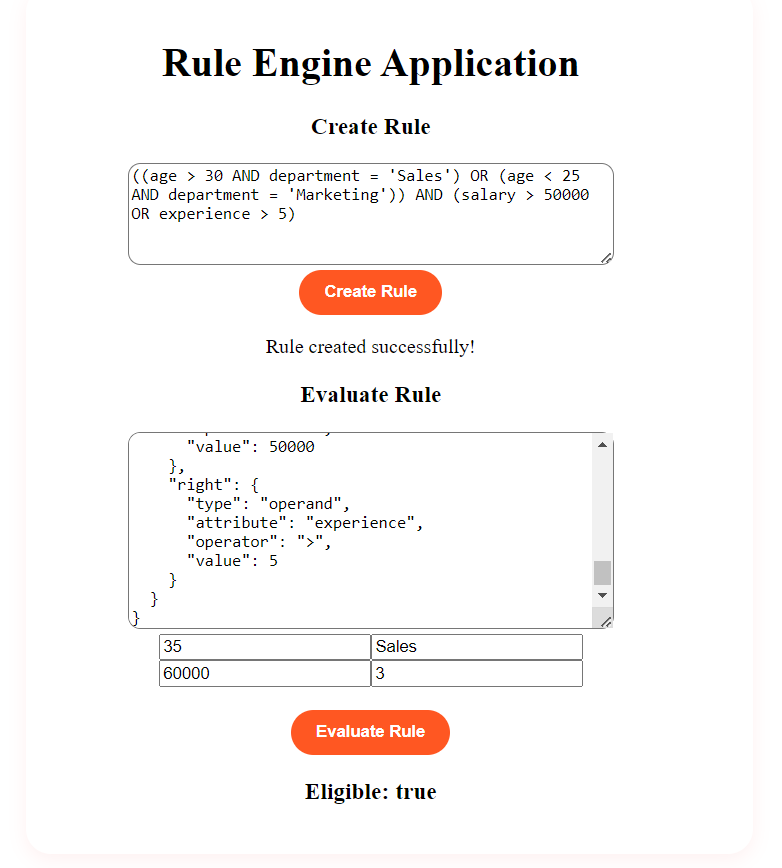
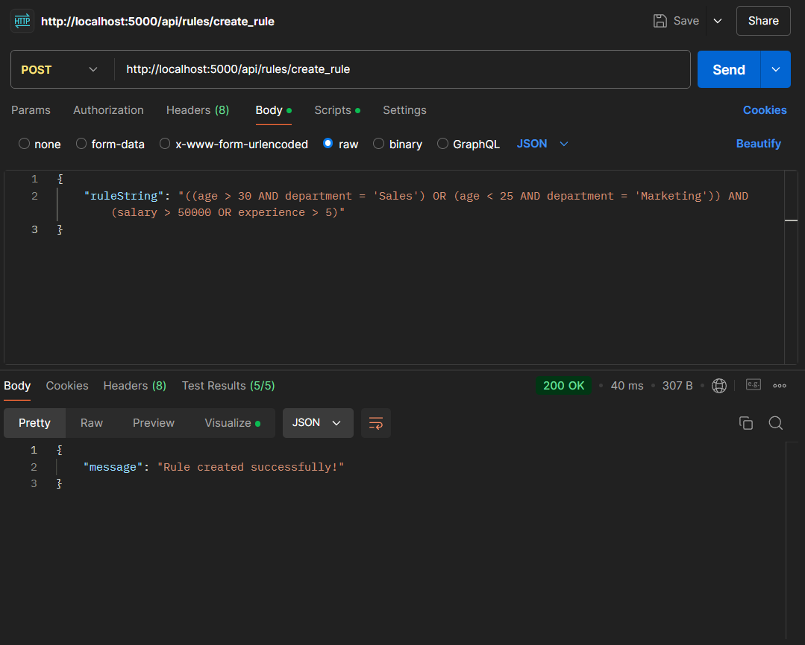
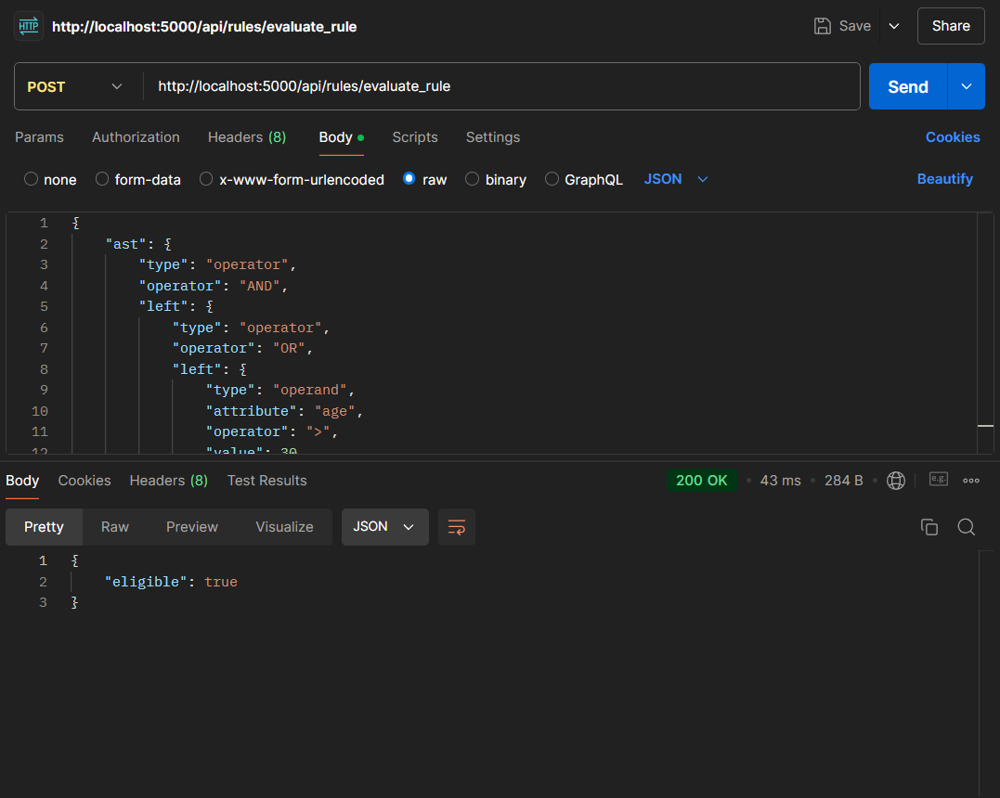
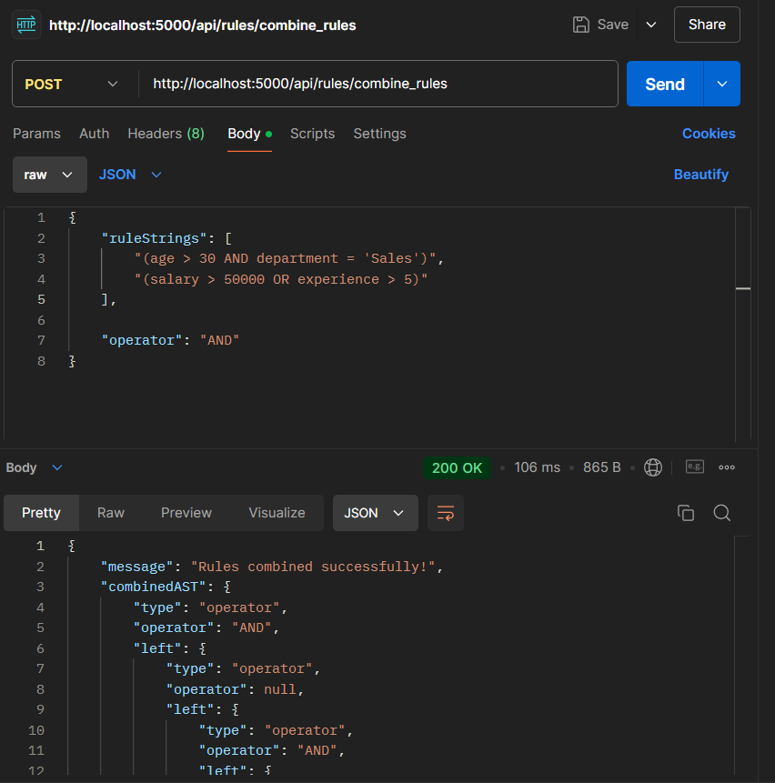

# Rule Engine with Abstract Syntax Tree(AST)

## Project Overview

This project is a Rule Engine that uses Abstract Syntax Tree (ASTs) to evaluate complex conditions based on user-defined rules. 
The engine allows the creation, combination, and evaluation of rules based on attributes such as age, department, salary, and experience.
The rules are stored in MongoDB for future use, and they are evaluated using a structured and efficient AST format.

## Features

- A user-friendly interface to input rules, and evaluate rules using sample user data.

- Rule Creation: Convert logical rule strings (e.g., age > 30 AND department = 'Sales') into ASTs.

- Rule Evaluation: Evaluate user-provided data against the rule AST to determine eligibility.

- Rule Combination: Merge multiple rules into a single, combined AST for complex logic.

-  All rules are stored in MongoDB.

## Technology Stack

- Frontend: React.js
- Backend: Node.js, Express.js
- Database: MongoDB
- API Testing: Postman

## Installation and Setup

### Backend Setup
1. Clone the repository:
    
        git clone https://github.com/yourusername/rule-engine-ast.git

2. Install dependencies:

        npm install

3. Set up environment variable by creating a .env file:
        
        ATLAS_URI = <your_mongodb_connection_string>
        PORT=5000

4. Start the backend server:

- Add scripts in package.json inside server folder

        "scripts": {
            "start": "node index.js",
            "dev": "nodemon index.js",
            "test": "echo \"Error: no test specified\" && exit 1"
        },
        
        npm start

### Frontend Setup

1. Navigate to the client folder:
        
        cd client

2. Install dependencies:
        
        npm install

3. Start the frontend:
        
        npm start

## API Endpoints

1. Create Rule
- Endpoint: POST /api/rules/create_rule
- Body:
        
        {
        "ruleString": "age > 30 AND department = 'Sales'"
        }

2. Combine Rules
- Endpoint: POST api/rules/combine_rules
- Body:
        
        {
        "ruleStrings": ["age > 30 AND department = 'Sales'", "salary > 50000"]
        }

3. Evaluate Rule
- Endpoint: POST /api/rules/evaluate_rule
- Body:
        
        {
            "ast": { ... }, 
            "data": {
                "age": 35,
                "department": "Sales",
                "salary": 60000
            }
        }

## Testing
- You can test the API endpoints using Postman by performing the following:
1. Create Rule: Send a POST request to create a rule and verify it is stored in the database.
2. Evaluate Rule: Test the rule evaluation with different datasets and observe the result (true/false).
3. Combine Rule: Combine two rules with an operator and observe the result as rules combined in mongoDB database.

